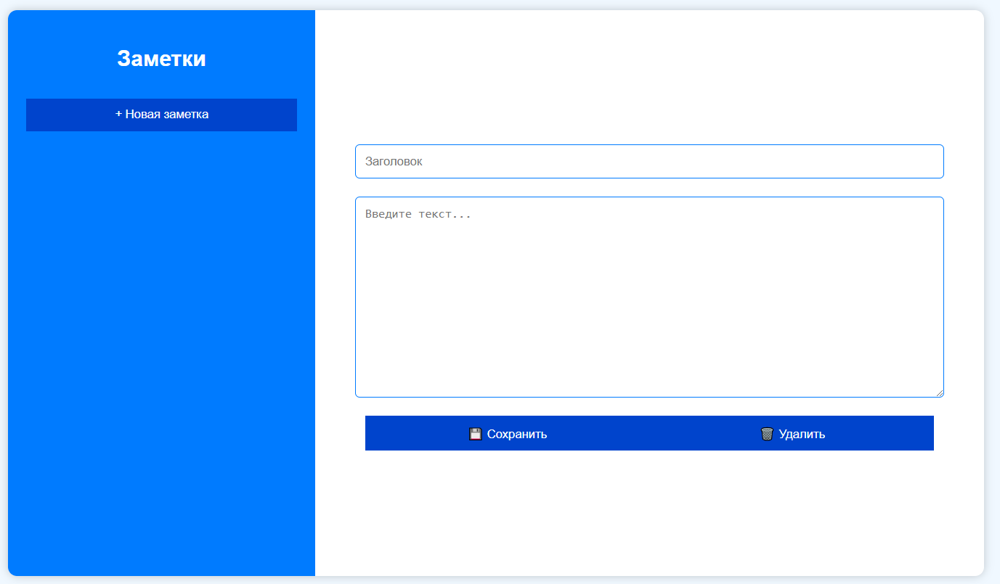
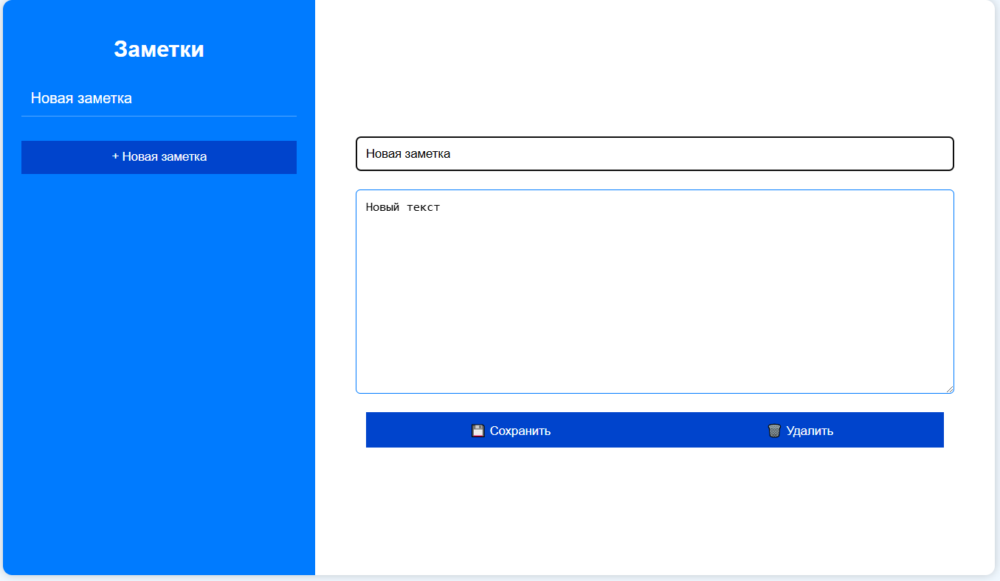

# Note Management API

## Описание
Этот проект представляет собой REST API для управления заметками. Включает в себя создание, получение, обновление и удаление заметок.

## Стек технологий
- **Java 17**
- **Spring Boot**
- **Spring Data JPA**
- **Lombok**
- **Docker**
- **PostgreSQL**
- **Mockito & JUnit** (для тестирования)
- **Swagger (Springdoc OpenAPI)**

## Установка и запуск
### 1. Клонирование репозитория
```sh
 git clone https://github.com/asem25/NordSteelTest.git
 cd your-repo
```

### 2. Сборка проекта
```sh
mvn clean install
```

### 3. Запуск приложения
```sh
mvn spring-boot:run
```

## Архитектура проекта
Структура проекта организована следующим образом:
```
main/java/ru/semavin/microservice
│── config          # Конфигурационные классы
│── controllers     # Контроллеры REST API
│── dtos           # DTO-объекты
│── mapper         # Мапперы для преобразования данных
│── models         # Сущности базы данных
│── repositories   # Интерфейсы доступа к БД (Spring Data JPA)
│── services       # Бизнес-логика приложения
│── util           # Вспомогательные классы

resources/
│── static.docs.javadoc  # Документация Javadoc
│── templates            # Шаблоны
│── application.properties # Конфигурационный файл

test/java/ru/semavin/microservice
│── config          # Тестовые конфигурации
│── controllers     # Тесты контроллеров
│── MicroserviceApplicationTests # Главный тестовый класс
```

## API Эндпоинты

### 1. Создание заметки
**POST /api/notes**
```json
{
    "title": "Название",
    "content": "Текст заметки"
}
```

### 2. Получение всех заметок
**GET /api/notes**

### 3. Получение заметки по ID
**GET /api/notes/{id}**

### 4. Обновление заметки
**PUT /api/notes/{id}**
```json
{
    "title": "Новое название",
    "content": "Обновленный текст"
}
```

### 5. Удаление заметки
**DELETE /api/notes/{id}**

## Тестирование
Запуск тестов выполняется командой:
```sh
mvn test
```

## Основной функционал (скриншоты)



**Подпись автора:**

Александр (aka. asem25)

[Github](https://github.com/asem25)

[Telegram](https://t.me/asem250604)